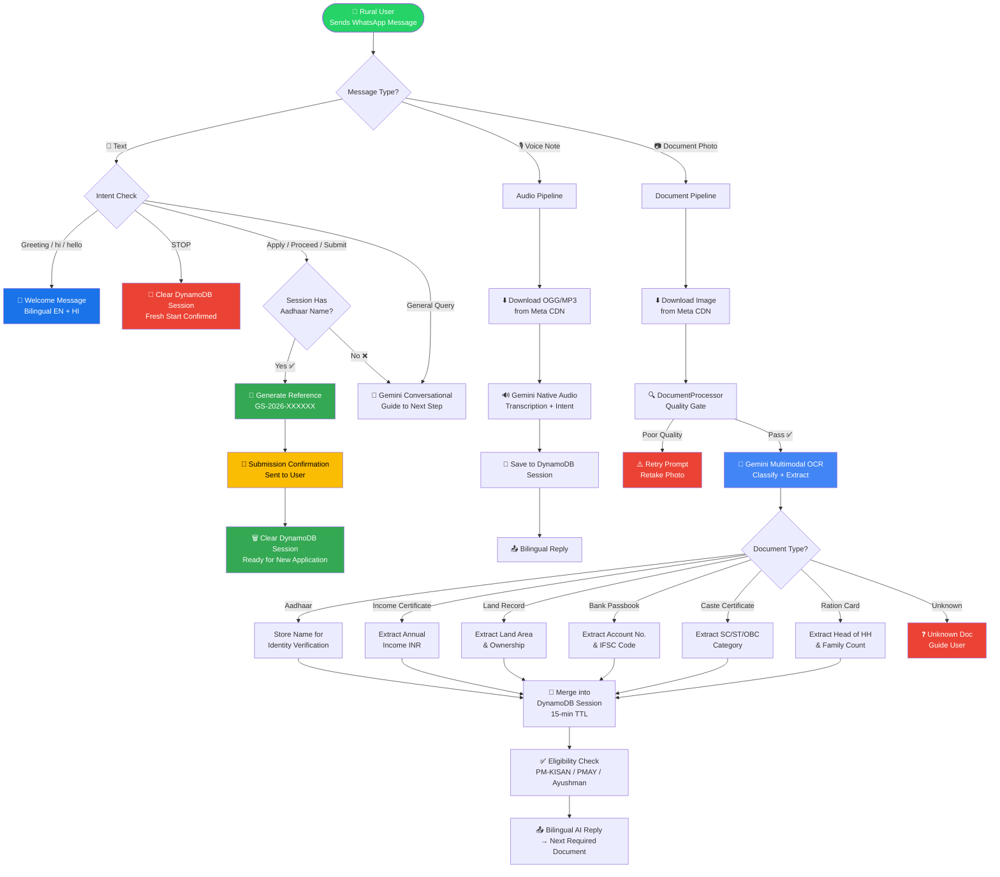

<div align="center">

# 🌱 GramSetu

### *Bridging the Rural-Digital Divide — One WhatsApp Message at a Time*

**A serverless WhatsApp AI agent that helps rural Indian citizens apply for government welfare schemes using voice notes and document photos — in their own language.**

[](https://python.org)
[](https://ai.google.dev)
[](https://aws.amazon.com/lambda/)
[](https://developers.facebook.com/docs/whatsapp)
[](https://fastapi.tiangolo.com)
[](https://aws.amazon.com/dynamodb/)

</div>

---

## 🎬 Live Demo

<div align="center">

[](https://youtu.be/Ta11OqlqiZE?si=rKkNKg4JMO3vZEoH)

**▶️ [Watch Full Demo on YouTube](https://youtu.be/Ta11OqlqiZE?si=rKkNKg4JMO3vZEoH)**

</div>

---

## 📸 Screenshots

<div align="center">

| Welcome & Scheme Selection | Document Upload & OCR | Eligibility & Submission |
|:---:|:---:|:---:|
|  |  |  |
| Bilingual welcome + scheme picker | Gemini extracts data from Aadhaar photo | Auto-generates reference number |

</div>

---

## 🔄 Process Flow



---

## ✨ Features

| Feature | Description |
|---|---|
| 🌐 **Zero-App Access** | Works entirely over WhatsApp — no app download required |
| 🗣️ **Voice-First** | Send a voice note; Gemini transcribes and understands intent natively |
| 📄 **Universal OCR** | Snap a photo of any document — AI classifies and extracts data automatically |
| 🤝 **Bilingual** | Every reply is in both English and Hindi (हिंदी) |
| 🧠 **Session Memory** | DynamoDB tracks uploaded documents for 15 minutes so users are never asked twice |
| 🔒 **Identity Verification** | Cross-checks names across documents against the registered Aadhaar |
| 🧾 **7 Document Types** | Aadhaar, Income Certificate, Land Record, Bank Passbook, Caste Certificate, Ration Card, Crop Certificate |
| 🚀 **One-Tap Submission** | Say "proceed" or "submit" to get an instant application reference number |
| 🚨 **STOP Command** | Text "STOP" to instantly wipe session and start fresh |
| ☁️ **Fully Serverless** | AWS Lambda + API Gateway — scales to zero when idle |

---

## 🏛️ Supported Government Schemes

| Scheme | Benefit | Key Requirement |
|---|---|---|
| **PM-KISAN Samman Nidhi** | ₹6,000/year | Farmer with land record |
| **Ayushman Bharat (PM-JAY)** | ₹5 Lakh health cover | Family income < ₹1,00,000 |
| **PM Awas Yojana (PMAY-G)** | Housing assistance | Kutcha house, income < ₹1,50,000 |
| **MGNREGA** | 100 days guaranteed work | Rural household |
| **PM Jan Dhan Yojana** | Zero-balance bank account | Any resident |

---

## 🏗️ Architecture

```
WhatsApp User
     │  (Cloud API webhook POST)
     ▼
API Gateway (HTTP API)
     │
     ▼
WebhookHandler Lambda  ──── FastAPI router
     │
     ├── text  ──────────► Gemini Conversational  ──► DynamoDB Session
     │                                                      │
     ├── audio ──────────► Gemini Native Audio  ────────────┤
     │                     (transcribe + intent)            │
     └── image/doc ──────► DocumentProcessor               │
                           (quality gate)                   │
                               │                           │
                               ▼                           │
                          AI Reasoner                      │
                          (Gemini Multimodal OCR) ◄────────┘
                               │
                          S3 Media Bucket
                          (temp storage)
```

**AWS Resources deployed via SAM:**
- `WebhookHandlerFunction` — FastAPI webhook receiver
- `DocumentProcessorFunction` — Image quality gate
- `AIReasonerFunction` — Gemini multimodal OCR & classification
- `VoiceProcessorFunction` — Gemini native audio pipeline
- `PDFGeneratorFunction` — Pre-filled government form generation
- `GramSetuSessionsTable` — DynamoDB (15-min TTL session store)
- `GramSetuTable` — DynamoDB (permanent scheme + user data)
- `GramSetuMediaBucket` — S3 (incoming media + generated PDFs)

---

## 🛠️ Tech Stack

| Layer | Technology |
|---|---|
| **AI / LLM** | Google Gemini `gemini-3.1-flash-lite-preview` (multimodal) |
| **Messaging** | Meta WhatsApp Cloud API v18.0 |
| **Backend** | FastAPI + Uvicorn on AWS Lambda |
| **Infrastructure** | AWS SAM (Lambda, API Gateway, DynamoDB, S3) |
| **Session Store** | Amazon DynamoDB (on-demand, AES-256 encrypted, 15-min TTL) |
| **HTTP Client** | httpx (async-ready) |
| **Runtime** | Python 3.12 |
| **IaC** | AWS SAM + CloudFormation |

---

## 🚀 Local Setup

### Prerequisites
- Python 3.12+
- AWS CLI configured (`aws configure`)
- AWS SAM CLI (`pip install aws-sam-cli`)
- A Meta WhatsApp Business account + phone number ID
- A Google AI Studio API key ([get one free](https://aistudio.google.com))

### 1. Clone & install

```bash
git clone https://github.com/AM-officials/GramSetu.git
cd GramSetu
python -m venv .venv && source .venv/bin/activate   # Windows: .venv\Scripts\activate
pip install -r requirements.txt
```

### 2. Configure environment

```bash
cp .env.example .env
```

Edit `.env`:

```env
GEMINI_API_KEY=your_google_ai_studio_key
WHATSAPP_API_TOKEN=your_meta_bearer_token
WHATSAPP_PHONE_NUMBER_ID=your_phone_number_id
WHATSAPP_VERIFY_TOKEN=your_custom_verify_token
AWS_REGION=ap-south-1
TABLE_NAME=gramsetu-sessions-dev
```

### 3. Run locally

```bash
python run_webhook.py
# Webhook available at http://localhost:8000/webhook
```

Use [ngrok](https://ngrok.com) to expose it to Meta:
```bash
ngrok http 8000
# Set the ngrok HTTPS URL as your Meta webhook URL
```

### 4. Run tests

```bash
pytest tests/ -v
```

---

## ☁️ Deploy to AWS

```bash
cp samconfig.toml.example samconfig.toml
# Edit samconfig.toml with your values

sam build
sam deploy
```

SAM will provision all AWS resources and output the API Gateway URL. Set this as your Meta webhook URL.

---

## 📁 Project Structure

```
GramSetu/
├── src/
│   ├── ai_reasoner/          # Gemini multimodal client + prompt builder
│   ├── document_processor/   # Image quality gate (blur, brightness checks)
│   ├── pdf_generator/        # Pre-filled government form PDF generation
│   ├── shared/               # DynamoDB session manager, types, models
│   ├── voice_processor/      # Audio pipeline helpers
│   ├── webhook_handler/      # FastAPI routes (main entry point)
│   └── whatsapp_client/      # Meta Cloud API send/download client
├── tests/                    # pytest test suite (56 tests)
├── layer/                    # Lambda Layer dependencies
├── template.yaml             # AWS SAM infrastructure definition
├── samconfig.toml.example    # Deploy configuration template
├── .env.example              # Environment variable template
└── run_webhook.py            # Local development server
```

---

## 🔐 Security

- All API credentials are loaded from environment variables — **never hardcoded**
- `.env` and `samconfig.toml` are in `.gitignore` and never committed
- DynamoDB tables use **AES-256 server-side encryption** at rest
- Session data auto-expires after **15 minutes** via DynamoDB TTL
- `WHATSAPP_API_TOKEN` and `WhatsAppAccessToken` are marked `NoEcho: true` in SAM

---

## 📄 License

This project is private. All rights reserved © 2026 AM-officials.

---

<div align="center">

Built with ❤️ to serve rural India 🇮🇳

*"Technology should reach the last mile."*

</div>
